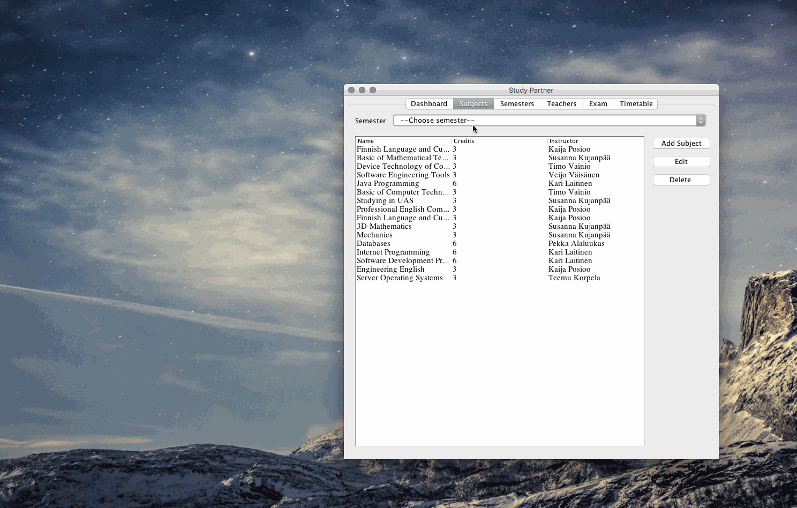
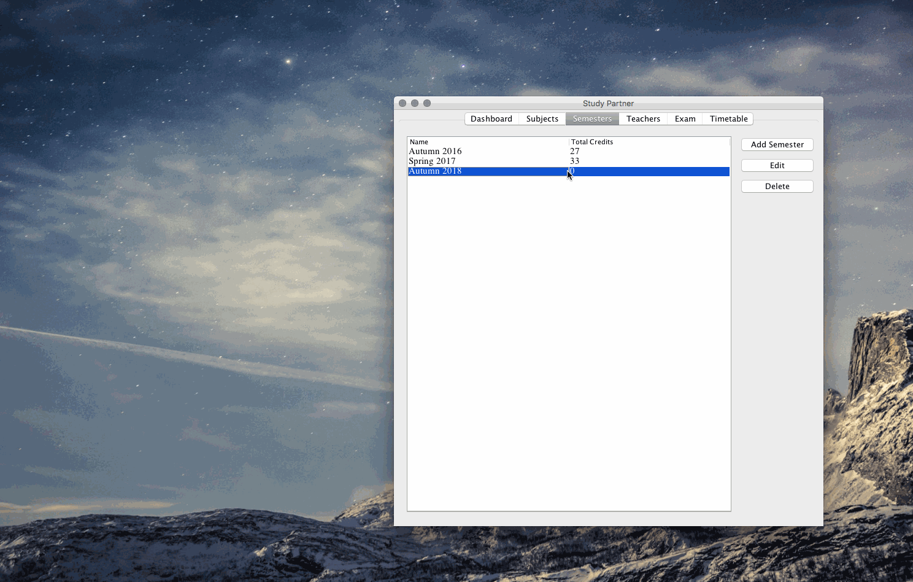
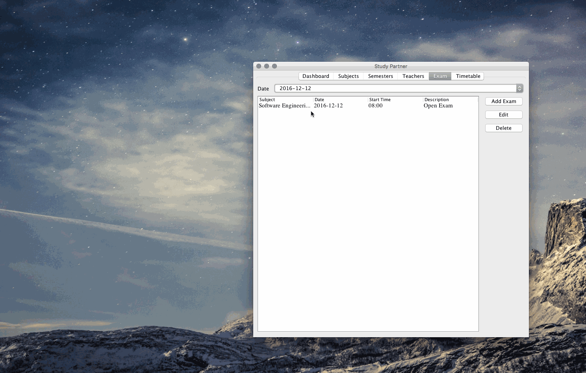

# Study Partner

This is my project for Introduction to Programming course at Oulu UAS. The motivation for this
project is the need for an application that can help me to manage my schedule. Besides that, it can also help me
to store the information of each course, including exam, teacher info, etc.

## Getting Started

Basically, this project is mainly used for myself only meaning that it cannot run on other machines
unless that machine has my .sql file database. However, in the future I can scale my app so that it
will use xml or json format as a main storage method.

### Technologies

+ Java
+ MySQL database

### Prerequisites

1. MySQL Server
2. Java JDK

### Installing

1. Install MySQL according to [MySQL
   documentation](https://dev.mysql.com/doc/refman/5.7/en/installing.html)

2. Install Java JDK through [Oracle
   page](http://www.oracle.com/technetwork/java/javase/downloads/jdk8-downloads-2133151.html)

3. Create a database called study_parner1 and import the .sql file inside data/ folder

4. Run .jar file inside out/artifacts/Study_Partner_jar/Study_Partner.jar

### Demo

Note that the application will automatically update contents whenever users change something. So
there's no need to restart the application after modifying.

#### Dashboard + Subject tab

#### Semester + Teacher tab

#### Exam + Timetable tab

